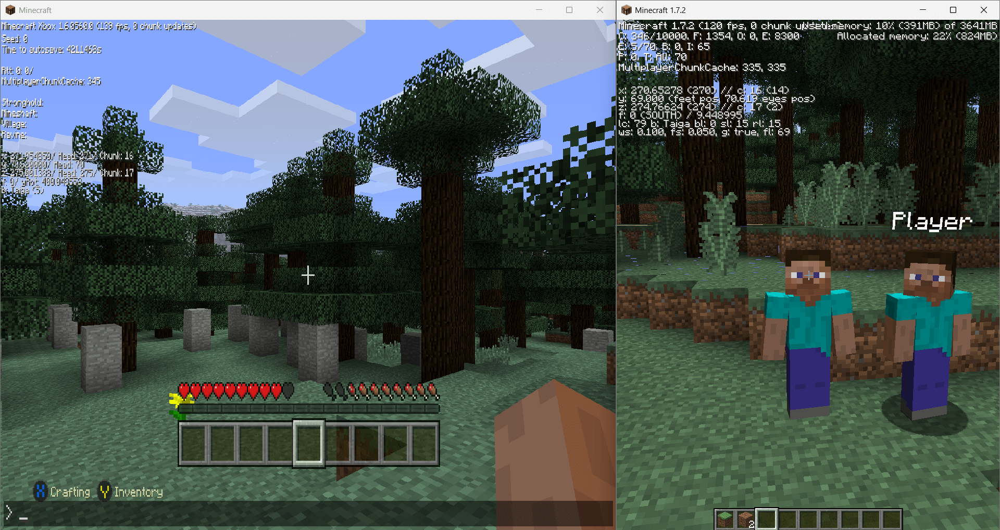

# VoxelBridge

VoxelBridge is a translation proxy that allows Minecraft Legacy Console Edition (LCE) to connect to Minecraft Java Edition servers.



> [!NOTE]
> Many gameplay packets are still missing or incomplete. Expect bugs and missing features. See **[/PACKET_TRACKING.md](PACKET_TRACKING.md)**

## Running the Proxy

### Prerequisites

*   Java 21 or newer
*   Maven (for building)

### Build

```bash
mvn clean package
```

### Run

```bash
java -jar target/voxelbridge-1.0-SNAPSHOT.jar
```

It will generate a `config.yml` file when you run the proxy for the first time.

### Connecting

1.  Start your target Minecraft Java Edition server (1.7.2).
2.  Configure `config.yml` to point to your Java server.
3.  Run VoxelBridge.
4.  Open Minecraft Legacy Console Edition (e.g., Windows, Xbox 360, PS3) on the same network.
5.  The proxy should appear in the LAN games list.

## FAQ

### What Legacy Console Edition version is supported?

Currently, **Title Update 19 (TU19)** is supported.

Other versions of Legacy Console Edition may not work correctly because the network protocol differs between updates.

### How do I join servers newer than 1.7.2?

You can use [ViaProxy](https://github.com/ViaVersion/ViaProxy) to connect to newer Java Edition servers. ViaProxy can also handle Mojang authentication, allowing you to join online-mode servers.

### Does this affect performance?

It should not significantly affect performance. The networking model used by Legacy Console Edition is very similar to Java Edition, so the proxy overhead should be minimal.

### Is there a prebuilt JAR available?

Yes. You can download the latest compiled JAR from the **Actions** tab of the repository. Download the latest artifact from the most recent workflow run.

### Something doesn't work

The project is still in **early development**, and many packets are not fully implemented yet.

Check [PACKET_TRACKING.md](PACKET_TRACKING.md) to see which features and packets are currently implemented.

### I found a bug!

Please report bugs in the **Issues** tab.

If you are able to fix the issue yourself, feel free to submit a pull request.

[//]: # (## Compatibility Notes)

[//]: # ()
[//]: # (Some server-side anticheat plugins may flag players connected through the proxy.  )

[//]: # (This can happen if the translation layer sends slightly incorrect or incomplete packets due to unfinished or incorrect implementations.)

[//]: # ()
[//]: # (If you encounter anticheat-related problems while using VoxelBridge, please open an issue so the behavior can be investigated and improved.)